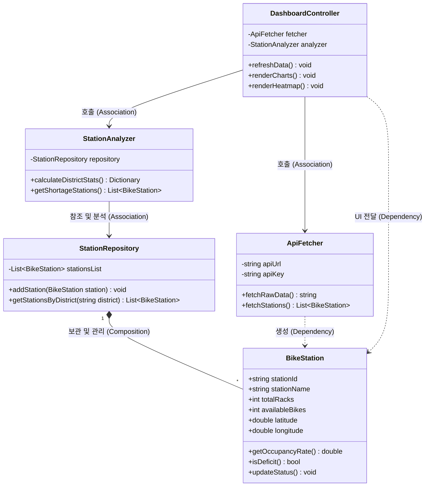

# project

```mermaid
classDiagram
    class BikeStation {
        +string stationId
        +string stationName
        +int totalRacks
        +int availableBikes
        +double latitude
        +double longitude
        +getOccupancyRate() double
        +isDeficit() bool
        +updateStatus() void
    }

    class StationRepository {
        -List~BikeStation~ stationsList
        +addStation(BikeStation station) void
        +getStationsByDistrict(string district) List~BikeStation~
    }

    class ApiFetcher {
        -string apiUrl
        -string apiKey
        +fetchRawData() string
        +fetchStations() List~BikeStation~
    }

    class StationAnalyzer {
        -StationRepository repository
        +calculateDistrictStats() Dictionary
        +getShortageStations() List~BikeStation~
    }

    class DashboardController {
        -ApiFetcher fetcher
        -StationAnalyzer analyzer
        +refreshData() void
        +renderCharts() void
        +renderHeatmap() void
    }

    StationRepository "1" *-- "*" BikeStation : 보관 및 관리 (Composition)
    ApiFetcher ..> BikeStation : 생성 (Dependency)
    StationAnalyzer --> StationRepository : 참조 및 분석 (Association)
    DashboardController --> ApiFetcher : 호출 (Association)
    DashboardController --> StationAnalyzer : 호출 (Association)
    DashboardController ..> BikeStation : UI 전달 (Dependency)
```
